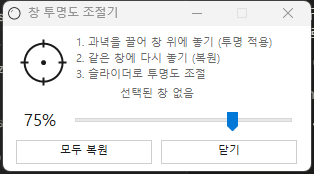
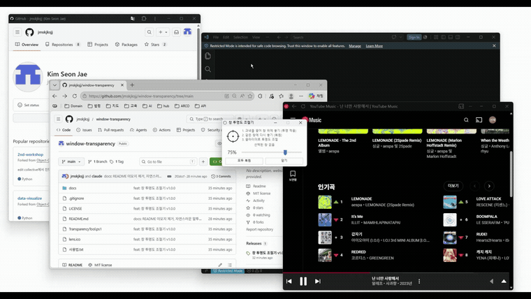

# 창 투명도 조절기

원하는 창을 반투명하게 만들어 주는 작은 윈도우 유틸리티입니다.



## 데모

실제로 창을 투명하게 만드는 모습입니다.



더 선명한 원본 영상은 [demo.mp4](docs/demo.mp4) 에서 받아 볼 수 있습니다.

## 뭐 하는 프로그램인가

과녁 아이콘을 마우스로 끌어다 투명하게 만들고 싶은 창 위에 놓으면 그 창이 반투명해집니다. 슬라이더로 투명도를 조절하고요. 영상 보면서 그 위에 메모창을 띄워두거나, 자료를 보면서 뒤에 다른 창을 비쳐 보고 싶을 때 쓸 만합니다.

설치는 필요 없습니다. exe 하나 더블클릭하면 끝이고, Windows 10이나 11이면 그냥 돌아갑니다.

## 다운로드

[Releases](../../releases)에서 exe나 zip을 받아서 더블클릭하면 됩니다.

처음 실행할 때 "Windows의 PC를 보호했습니다" 같은 파란 경고창이 뜰 수 있는데, 서명을 안 한 개인 프로그램이라 그렇습니다. "추가 정보"를 누르고 "실행"하면 됩니다. 백신이 가끔 오탐하기도 하는데 동작에는 문제 없습니다.

## 사용법

1. 과녁(둥근 아이콘)을 마우스로 누른 채 끌어서, 투명하게 만들 창 위에서 손을 뗍니다.
2. 슬라이더를 움직이면 투명도가 바로 바뀝니다. (5%에서 100%)
3. 이미 투명해진 창에 과녁을 다시 갖다 놓으면 그 창만 원래대로 돌아옵니다.
4. "모두 복원"을 누르면 그동안 건드린 창이 한꺼번에 다 돌아옵니다.

관리자 권한으로 띄운 창에 적용하려면 이 프로그램도 관리자 권한으로 실행해야 합니다. 안 그러면 윈도우가 막아버립니다.

## 직접 빌드

소스는 PowerShell 스크립트 하나(`TransparencyTool.ps1`)가 전부입니다. .ps1을 그대로 실행해도 되고, exe로 만들려면 ps2exe를 쓰면 됩니다.

```powershell
Install-Module ps2exe -Scope CurrentUser
Invoke-ps2exe -inputFile TransparencyTool.ps1 -outputFile "창 투명도 조절기.exe" `
    -iconFile lens.ico -noConsole -STA -version 1.0.0.0
```

## 원리

별거 없습니다. Win32의 `SetLayeredWindowAttributes`로 대상 창에 `WS_EX_LAYERED` 스타일을 붙이고 알파값을 넣어주는 게 다입니다. 투명도 퍼센트는 `alpha = round(퍼센트 × 255 / 100)`으로 바꿉니다. 외부 라이브러리 없이 윈도우에 기본으로 들어있는 PowerShell이랑 WinForms만 씁니다.

## 라이선스

MIT.
